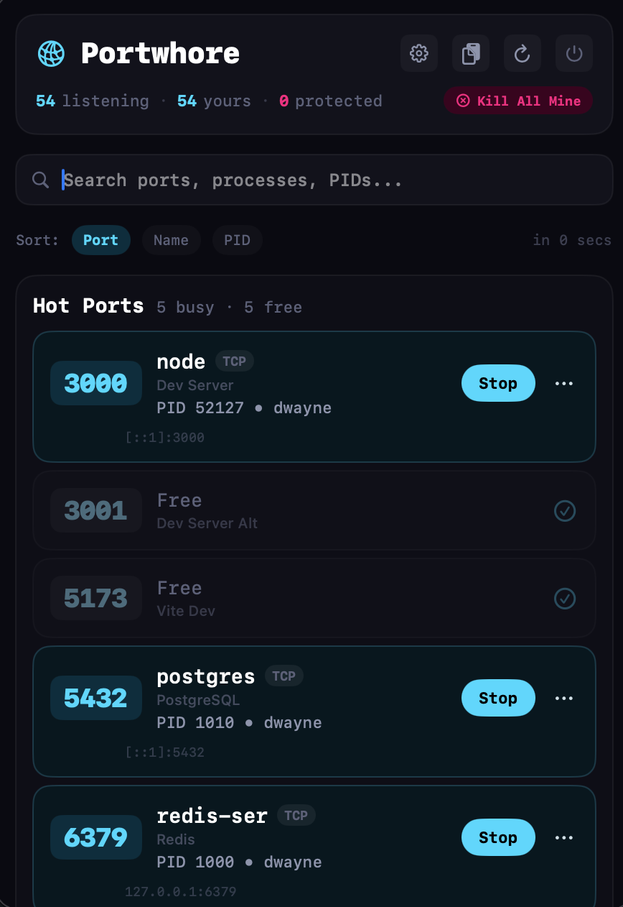

# Portwhore

A shameless macOS menu bar app that watches your ports.



Portwhore lives in your menu bar and keeps an eye on every listening port on your machine. See which processes own which ports, kill the ones hogging what you need, and get back to work.

## Features

- **Real-time port scanning** — monitors TCP and UDP listeners, refreshing on a configurable interval
- **Watched ports** — pin the ports you care about (defaults: 3000, 5173, 5432, 6379, 8080, and more)
- **Ownership at a glance** — color-coded indicators show whether a port is yours, shared, protected, or free
- **Process control** — stop (SIGTERM) or force kill (SIGKILL) processes directly from the popover
- **Custom labels** — name your ports inline so you remember what's running where
- **Well-known port recognition** — built-in database of 40+ common services (MySQL, PostgreSQL, Redis, Vite, etc.)
- **Quick actions** — open in browser, copy port/PID/command/endpoint/kill command to clipboard
- **Search and sort** — filter by name or port, sort by port number, process name, or PID

## Requirements

- macOS 26.0+
- Swift 6.2+

## Build

```bash
swift build
```

## Run

The included build script handles building the `.app` bundle and launching it:

```bash
./script/build_and_run.sh          # Build and run
./script/build_and_run.sh debug    # Build and attach lldb
./script/build_and_run.sh logs     # Stream log output
./script/build_and_run.sh verify   # Check if running
```

The built app lands in `dist/Portwhore.app`.

## Configuration

All settings are managed through the in-app Settings panel:

- **Watched ports** — add or remove ports to monitor (1–65535)
- **Refresh interval** — 2s, 5s, 10s, or 30s
- **Port labels** — assign custom names to any port
- **Reset** — restore defaults with one click

Settings persist via UserDefaults.

## How it works

Portwhore scans your system using `lsof` to discover listening TCP and UDP ports, enriches results with full command lines from `ps`, then groups and classifies everything by port and ownership. The menu bar icon reflects current state — dim when idle, lit up when ports are active.

## License

[MIT](LICENSE)
