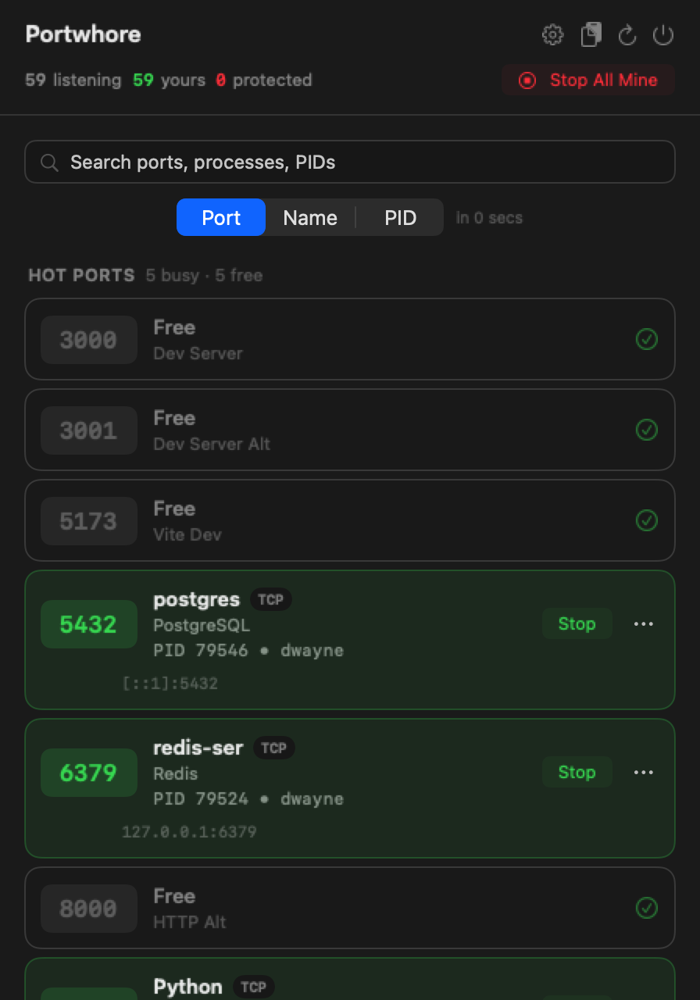

# Portwhore

A shameless macOS menu bar app that watches your ports.



Portwhore lives in your menu bar and keeps an eye on every listening port on your machine. See which processes own which ports, kill the ones hogging what you need, and get back to work.

## Features

- **Real-time port scanning** — monitors TCP and UDP listeners, refreshing on a configurable interval
- **Watched ports** — pin the ports you care about (defaults: 3000, 5173, 5432, 6379, 8080, and more)
- **Ownership at a glance** — color-coded indicators show whether a port is yours, a macOS service, shared, protected, or free
- **Process control** — stop (SIGTERM) or force kill (SIGKILL) processes directly from the popover. Portwhore waits to confirm the process exited and offers Force Kill if it ignored the stop request
- **Stop Hot Ports** — one button stops your processes on watched ports. Apps holding other ports (browsers, editors, sync clients) are left alone
- **macOS services called out** — ControlCenter, rapportd and friends are marked as system services, with a hint when AirPlay Receiver is sitting on 5000 or 7000
- **Custom labels** — name your ports inline so you remember what's running where
- **Well-known port recognition** — built-in database of 40+ common services (MySQL, PostgreSQL, Redis, Vite, etc.)
- **Quick actions** — open in browser, copy port/PID/command/endpoint/kill command to clipboard
- **Search and sort** — filter by port, process, PID, label, protocol, or endpoint; sort other listeners by port number, process name, or PID
- **Keyboard shortcuts** — ⌘F focuses search, ⌘R refreshes, ⌘, opens settings, and ⇧⌘C copies the port list

## Requirements

- macOS 26.0+
- Swift 6.2+

## Build

```bash
swift build
```

## Run

The included build script handles building the `.app` bundle and launching it:

```bash
./script/build_and_run.sh          # Build and run
./script/build_and_run.sh debug    # Build and attach lldb
./script/build_and_run.sh logs     # Stream log output
./script/build_and_run.sh verify   # Check if running
```

The built app lands in `dist/Portwhore.app`. Opening it again, even as a second copy, brings up the existing popover.

Run the regression tests with `swift test`. These cover socket parsing, large command output, search, sorting, and process-action state. Process-action tests use a fake controller; they do not stop your running services.

## Configuration

All settings are managed through the in-app Settings panel:

- **Watched ports** — add or remove ports to monitor (1–65535)
- **Refresh interval** — 2s, 5s, 10s, or 30s
- **Open at login** — start Portwhore when you log in (requires the `.app` bundle)
- **Port labels** — assign custom names to any port
- **Reset** — restore defaults with one click

Settings persist via UserDefaults. You can also watch or unwatch an active port from its row menu. Right-click a free watched port to copy its number or stop watching it.

Ports show “Not checked” until a scan succeeds. A failed scan retains the previous results and shows an error. After a stop, Portwhore waits briefly for the process to exit and tells you if it is still running. A process owned by another user can't be stopped from the app; use Copy Kill Command and run it with `sudo`. Action errors remain visible until dismissed or another stop action begins.

## How it works

Portwhore scans your system using `lsof` to discover listening TCP sockets and bound UDP sockets, skipping outbound UDP connections such as a browser's QUIC traffic. It enriches results with full command lines from `ps` and executable paths from the kernel, then groups and classifies everything by port and ownership. The menu bar icon reflects current state — dim when idle, lit up when ports are active.

## License

[MIT](LICENSE)
